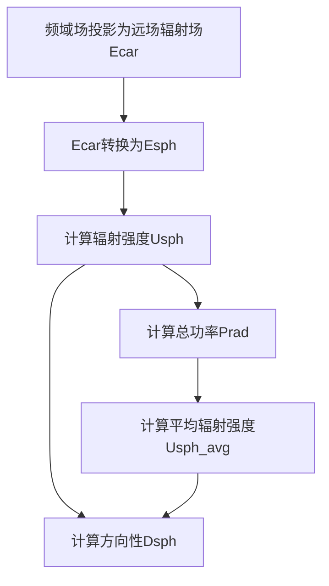
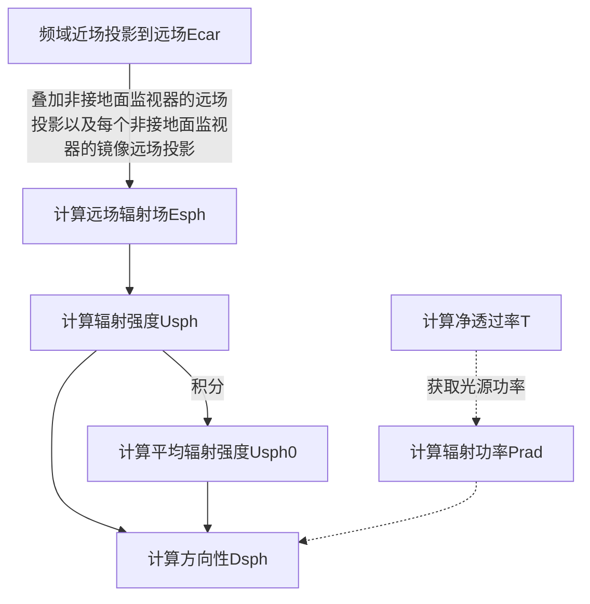

# 前言

根据 IEEE 的定义，**方向性**（directivity，旧称 directive gain）是指定方向辐射功率$\boldsymbol{U}$与所有方向辐射功率平均值$\bar U$的比值[^1]。方向性，是由远场的进一步分析得到，是描述远场辐射特性的重要参数之一。使用本软件的`FDTD`求解器，对远场进一步分析、计算，就得到了`Directivity`方向性分析组。

本文包括：

- 求解辐射功率$P_{rad}$、方向性$D$等参数；
- 方向性分析组的工作流程；
- 举例：`dipole`源的辐射功率$P_{rad}$、方向性$D$、最大方向性$D_{max}$等参数。

# 方向性分析组

## 分析组计算流程

根据方向性的定义，实现方向性分析组的计算。

一般的，方向性的计算流程为：

## 剔除源功率

对于接地的散射体，方向性的计算流程与未接地的基本相同，区别在于不再计算接地面的贡献，同时，对于非接地面的近场，被镜像投影到-Z 轴（此时$\theta$的取值范围为[0,90]，而默认$\theta$的取值范围为[0,180]），两者贡献的和即为完整的辐射场方向性，计算流程为：

## 更多参数定义和细节

### 方向性分量

与远场数据类似，同样的，对于球坐标系下，方向性$\boldsymbol{D}(r, \theta, \phi)$也不具有径向分量$D_r$，因此，我们软件中只展示了$D_\theta$和$D_\phi$，这通常是有效的。

对于$D_r$不为$0$的情况，通常是由于远场条件未被满足，此时，工程往往可以直接仿真，此时，直接仿真将获取更准确的结果。

### 对称性和对称边界

当仿真工程具有良好的对称性时，我们的软件支持对称边界，这将极大提升仿真效率。
但是会对后处理带来一定的困难，即不能直接获取完全对称空间的近场。

对于近场数据的镜像，一般的，思路是按照对称关系，镜像计算完整的近场结果；特别的，远场计算的结果具有良好的对称性，因此，也可以将镜像关系用在近场到远场投影的过程中。本质上，这两种方式的效果一样，计算效率也接近。

幸运的是，以上过程，我们软件的方向性分析组已全部实现。

### 辐射图和极坐标图

远场辐射图是远场可视化最常用的展示方式。方向性源自远场，使用辐射图是自然的。

但辐射图（三维图像）的理解是困难的，当用户感兴趣的是某一平面，应该使用极坐标系的绘图方式展示和分析；或者要求对特定的几个角度感兴趣，那么，了解辐射图和极坐标系图的转换是必要的。

一般的几何关系如下图所示，

相关细节参见后文的案例。

# 测试案例：全空间/接地的偶极子的辐射方向性

对于偶极子的辐射方向性测试案例，分别计算全空间/接地两种情况，工程为：

结果为：

对于固定平面，有

# 附录

## 方向性

### 辐射强度

Prad 的计算假设所有功率都被监视器盒捕获，并且捕获的功率来自辐射天线元件本身，而不是来自盒子外部的外部源。然而，在实践中，天线需要使用外部源（称为天线馈电）进行激励，该源必须穿过盒子。天线馈电携带的功率将显着影响计算出的 Prad。为了纠正这一点，我们允许用户在天线馈电周围指定一个窗口，减去该馈电线携带的功率。必须仔细选择此窗口的大小，以仅捕获输入功率，而不是天线的辐射功率。在大多数情况下，源窗口和源的位置和大小应匹配（有关更多详细信息，请参阅矩形探头天线示例）。如果天线馈电本身对总辐射有贡献，则应测试窗口尺寸对方向性和辐射功率的影响。
对于$U_0$，有
$$U_0 = \frac{P_{rad}}{4\pi}$$
$$U(\theta,\phi) = \frac{1}{2\eta}[|E_\theta|^2 + |E_\phi|^2]$$

### 辐射功率

$P_{rad}$表示**总的辐射功率(watt)**。
对于$P_{rad}$，计算公式为：
$$P_{rad} = \iint_\Omega U(\theta,\phi) d\Omega$$

### 平均辐射强度

$$P_{rad} = \iint_\Omega U(\theta,\phi) d\Omega$$

### 方向性

**方向性**（旧称 directive gain）的定义是指定方向辐射功率与所有方向辐射功率平均值的比值。
$$D \equiv \frac{U}{\bar U} \tag{*}$$

其中，
$U$表示**辐射强度(W/unit solid angle)**
$\bar U$表示**各向同性源的辐射强度(W/unit solid angle)**

在我们软件中，使用分析组`Directivity`，可以直接获得方向性。

若定义$U_{max}$表示**最大辐射强度**，最大方向即为：

$$D_{max} = \frac{U_{max}}{U}$$

此外，定义**部分方向性**（给定偏振的部分辐射强度除以所有方向上总辐射强度的平均值），易知在球坐标系中，由于远场辐射场仅包含$E_\theta$、$E_\phi$($E_r\approx0$)，定义总的方向性为

$$D = D_\theta + D_\phi$$

## 接地

在许多情况下，将天线视为安装在金属接地层的顶部是合适的。当接地层足够大并且我们在足够低的频率下工作时，它可以被建模为无限大的完美电导体（PEC）。PEC 接地的存在可以预见地改变天线系统的辐射特性。例如，从天线辐射到地平面的任何能量都会经历反射并反射回来，天线将在接地平面上设置辐射自身的电流。

在方向性分析组中使用图像理论来解释无限 PEC 地平面。接地平面上的天线被替换为天线及其虚拟图像的等效系统，该系统在接地平面上方提供正确的场分布。在地平面下方，场为零。该技术是在分析组中通过将地平面上方的一组监视器投影到负半空间 （-z） 中来实现的，这相当于在地平面下方具有一组监视器并将它们投影到正半空间（+z）中。这个过程允许我们使用有限尺寸的盒子来捕获所有辐射场，即使无限 PEC 地平面上的感应电流有助于盒子外的辐射。

# 参考文献

[^1]: C. A. Balanis, Antenna Theory and Design, 4th Edition. John Wiley & Sons (2016).
