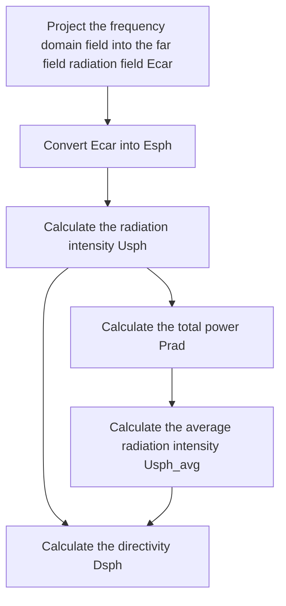
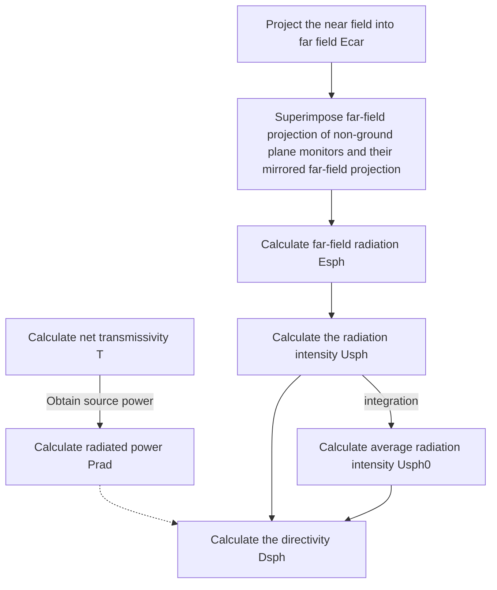

# Preface

As defined by IEEE, **Directivity** (formerly known as directive gain) is the ratio of the radiated power in the specified direction $\boldsymbol{U}$ to the average radiated power in all directions $\bar U$[^1]. Directivity, obtained from further analysis of the far field, is one of the important parameters describing the far field radiation characteristics. You can use the `Directivity` analysis group to compute directivity.

This document includes:

- Solving parameters such as radiated power $P_{rad}$ and directivity $D$;
- Workflow of Directivity analysis group
- Example: Radiated power of `dipole` source $P_{rad}$, directivity $D$, maximum directivity $D_{max}$ and other parameters.

# Directivity analysis group

## Analysis group calculation process

Program the Directivity analysis group based on the definition of directivity.

Generally, the directivity calculation process is:

## Eliminating source power

For a grounded scatterer, its directivity calculation process is basically the same as that of an ungrounded scatterer. The difference is that the contribution of the ground plane is no longer calculated. At the same time, the near field of the non-ground plane is mirrored and projected to the Z axis (at this time, the value range of the $\theta$ is [0,90], while the default value range of $\theta$ is [0,180]). The sum of the two contributions is the complete radiation field directivity. The calculation process is:

## More parameter definitions and details

### Directivity components

Similar to far-field data, in the spherical coordinate system, the directivity $\boldsymbol{D}(r, \theta, \phi)$ does not have a radial component $D_r$. Therefore, only $D_\theta$ and $D_\phi$ are shown in our software, which are usually effective.

For the situation where $D_r$ is not $0$, usually the far field conditions are not met. At this time, the project can often be directly simulated, which leads to more accurate results.

### Symmetry and symmetric boundaries

When the simulation project has good symmetry, we support symmetric boundaries, which will greatly improve simulation efficiency.
However, this will bring difficulties in post-processing, that is, the near field of a completely symmetric space cannot be directly obtained.

The near-field data is generally mirrored according to the symmetry relationship to calculate the complete near-field result. In particular, the results of the far-field calculation are well symmetrically, so the projection from near-field to far field can also be mirrored. Essentially, the effects of these two methods are the same, and the computational efficiency is also close.

Fortunately, the above process has been fully achieved by the Directivity analysis group.

### Radiation patterns and polar plot

Far-field radiation patterns are the most commonly used presentation method for far-field visualization. Since directivity arises from the far field, it is naturally shown as radiation patterns.

However, it is difficult to understand radiation patterns (three-dimensional images). A certain plane (or several specific angles) that the user is interested in should be plotted in a polar coordinate system for display and analysis. Therefore, it is necessary to understand the conversion between the radiation pattern and the polar coordinate system.

The general geometric relationship is shown in the figure below.

For relevant details, see the case below.

# Test case: Radiation directivity of a full-space/grounded dipole

For the test case of dipole radiation directivity, two cases of full space and grounding are calculated respectively. The project is:

The results are:

For a fixed plane,

# Appendixes

## Directivity

### Radiation intensity

Prad's calculations assume that all power is captured by the monitor box, and that the captured power comes from the radiating antenna itself, rather than from an external source outside the box. In practice, however, the antenna needs to be excited using an external source (called an antenna feed), which must pass through the box. The power carried by the antenna feed will significantly affect the calculated Prad. To correct for this, the user is allowed to specify a window around the antenna feed to counteract the power carried by that feed. The size of this window must be carefully chosen to capture only the input power and not the radiated power of the antenna. In most cases, the source window should match the location and size of the source (see the rectangular probe antenna example for more details). If the antenna feed itself contributes to the total radiation, the effect of window size on directivity and radiated power should be tested.
For $U_0$,
$$U_0 = \frac{P_{rad}}{4\pi}$$
$$U(\theta,\phi) = \frac{1}{2\eta}[|E_\theta|^2 + |E_\phi|^2]$$

### Radiated power

$P_{rad}$ represents the **total radiated power (watt)**.
For $P_{rad}$, the calculation formula is:
$$P_{rad} = \iint_\Omega U(\theta,\phi) d\Omega$$

### Average radiation intensity

$$P_{rad} = \iint_\Omega U(\theta,\phi) d\Omega$$

### Directivity

**Directivity** (formerly known as directive gain) is defined as the ratio of the radiated power in a specified direction to the average radiated power in all directions.
$$D \equiv \frac{U}{\bar U} \tag{*}$$

Where,
$U$ represents **radiation intensity (W/unit solid angle)**
$\bar U$ represents the **radiation intensity of isotropic source (W/unit solid angle)**

In our software, you can use the `Directivity` analysis group to obtain directivity directly.

If $U_{max}$ is defined to represent the **maximum radiation intensity**, the maximum direction is:

$$D_{max} = \frac{U_{max}}{U}$$

In addition, if **partial directivity** is defined as the partial radiation intensity in a given direction divided by the radiation intensity averaged over all directions, then the total directivity is defined as below in the spherical coordinate system since the far-field radiation field only contains $E_\theta$ and $E_\phi$($E_r\approx0$):

$$D = D_\theta + D_\phi$$

## Ground

In many instances, it is appropriate to consider the antenna as mounted on top of a metallic ground plane. When the ground plane is sufficiently large and we are operating at low enough frequencies, it may be modeled as an infinitely large perfect electrical conductor (PEC). The presence of the PEC ground predictably alters the radiation properties of the antenna system. For instance, any energy radiating from the antenna directed towards the ground plane undergoes a reflection and reflects back, and the antenna will setup currents on the ground plane which radiate themselves.

Image theory is used in the Directivity analysis group to account for the infinite PEC ground plane. The antenna over the ground plane is replaced with an equivalent system of the antenna and its virtual image, which provides the correct field distribution above the ground plane. Below the ground plane, the fields are zero. This technique is achieved in the analysis group by projecting the set of monitors above the ground plane into the negative half-space (-z), which is equivalent to having a set of monitors below the ground plane and projecting them into the positive half space (+z). This procedure allows us to use a finite-sized box to capture all the radiated fields, even though induced currents on the infinite PEC ground plane contribute to the radiation outside of the box.

# References

[^1]: C. A. Balanis, Antenna Theory and Design, 4th Edition. John Wiley & Sons (2016).
